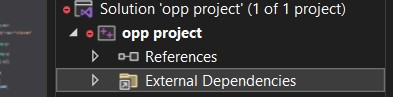
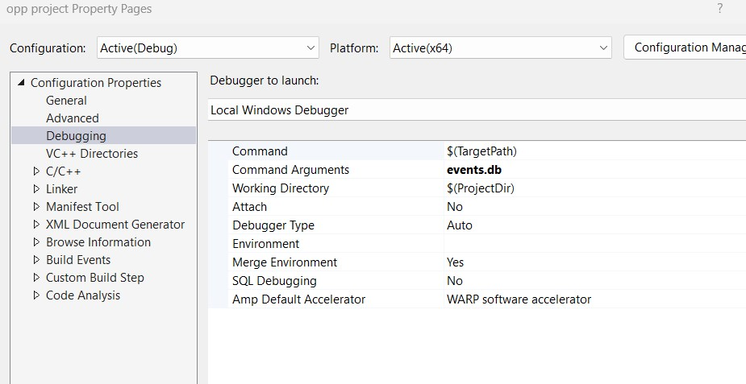

# Event Ticket Selling 

## Copyright

© 2024 Alex Ardelean. All rights reserved.App

## Overview

Welcome to the Event Ticket Selling App! This application allows users to conveniently browse and purchase tickets for various events. Whether it's concerts, sports events, or other entertainment gatherings, our app aims to provide a seamless ticket-buying experience.


## Setup Instructions

Step one:
Right click on the name of the project


Step two:
Go down to properties

Step three:
In the Debugging section, add "events.db" to Command Arguments



## Events Database

The events database for this app is stored in a `.db` file, and it follows a specific syntax. Below is a guide for understanding the syntax:

```plaintext
# Events database

#
# Comments are allowed :)))
#
# Syntax guide:
#
# event [name]
# ticket [standard/vip] [count/price] [value]
# ...
# end
#
# event ...
# ...
# end
